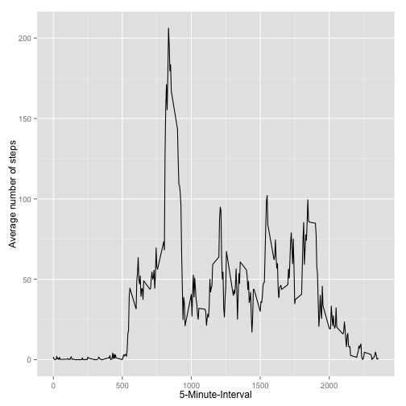
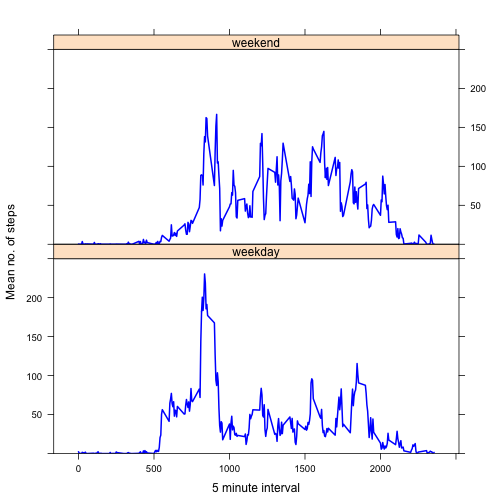

##Loading and preprocessing the data
###1. Load the data (i.e. `read.csv()` )
Since we have forked the instructor's repository into our githubs and cloned it locally, we already have the necessary files.  Simply, change the working directory in R Studio, then `unzip()` and load the file.


```r
activitydata<- read.csv("/Users/amalhaq/Desktop/amalpython/RepData_PeerAssessment1/activity.csv", header=TRUE, sep= ",") 
```

###2. Process/transform the data (if necessary) into a format suitable for your analysis
Okay, let's see if we need to fix up the table in anyway using the `str()` function


```r
str(activitydata)
```

```
## 'data.frame':	17568 obs. of  3 variables:
##  $ steps   : int  NA NA NA NA NA NA NA NA NA NA ...
##  $ date    : Factor w/ 61 levels "2012-10-01","2012-10-02",..: 1 1 1 1 1 1 1 1 1 1 ...
##  $ interval: int  0 5 10 15 20 25 30 35 40 45 ...
```

Looks like the date colum has class=FACTOR; we should change that to class=Date. I like working with the **lubridate** package but the 'as.date()' should be fine too.

```r
activitydata$date<- as.Date(activitydata$date)
```


##What is the mean total number of steps taken per day?
###1. Calculate the total number fo steps taken per day
First, we should calculate the sum for each day, then we can take the mean across the days. I am going to use the **dplyr** package


```r
groupeddata<- group_by(activitydata, date)
summeddata<- summarise(groupeddata, sum(steps))
names(summeddata)<- c("date", "total steps")
```
or another way to do it is `rowsum(activitydata$steps, activitydata$date)`, where the first argument is the data you want to sum, and the second argument is the 'group_by' argument

###2. Make a histogram of the total number of steps taken each day.
We can use the 'summeddata' dataframe and the base plotting package:

```r
 hist(summeddata$"total steps", breaks=10, main = "Histogram of Total No. of Steps by Day", xlab= "Steps")
```

 

###3. Calculate and report the mean and median of the total number of steps taken per day
First remove the NAs.

```r
summeddata$"total steps"<- as.numeric(as.integer(summeddata$"total steps"))
cleansums<- na.omit(summeddata)
```
Thus, the mean is

```r
mean(cleansums$"total steps")
```

```
## [1] 10766.19
```
And the median is

```r
median(cleansums$"total steps")
```

```
## [1] 10765
```


##What is the average daily activity pattern?
###1. Make a time series plot of the 5-minute interval and the average number of steps taken, averaged across all days.
We need something similar to before, but this time we need the mean number of steps (rather than the sum), and we are factoring it along each 5-minute intervals (rathern than along each day).  We can use the **dplyr** package again but I am going to try an `apply()` function. 

```r
dailypatt<- tapply(activitydata$steps, activitydata$interval, mean, na.rm=TRUE)
dailypatt.X<-as.numeric(names(dailypatt))
dailypatt.Y<-as.numeric(dailypatt)
```
I created the 'X' and 'Y' values as vectors because `tapply()` creates an array. Now, plot

```r
library(ggplot2)
qplot(dailypatt.X, dailypatt.Y, geom="line", xlab = "5-Minute-Interval", ylab = "Average number of steps")
```

 

###2. Which five minute interval has the highest mean number of steps?
This is quite simple, in the aggregate data frame "dailypatt" created above, look for the maximum value using the following code:

```r
dailypatt[dailypatt==max(dailypatt)]
```

```
##      835 
## 206.1698
```


##Imputing missing values
###1. Calculate and report the total number of missing values in the dataset (i.e. the total number of rows with NAs)
The following code gives NAs for **all** variables in the dataset:

```r
sum(is.na(activitydata))
```

```
## [1] 2304
```

###2. Devise a strategy for filling in all of the missing values in the dataset. The strategy does not need to be sophisticated. For example, you could use the mean/median for that day, or the mean for that 5-minute interval, etc.
Since we have already computed the means for each 5-minutes interval, let's use those to impute the missing values.  To do this, we will first create a dataframe of the means of each 5 minutes interval.  

```r
int.means<- data.frame(dailypatt.X, dailypatt.Y)
names(int.means) <- c("interval", "mean")
```


###3.Create a new dataset that is equal to the original dataset but with the missing data filled in.
Now, we can link the original dataset 'activitydata' with the dataset of 5-min interval means 'int.means' by matching them along the 5-minute interval, and then replacing the missing values in the "steps" column of 'activitydata' with the corresponding value in the "means" column of the 'int.means' dataset.  We will call the new dataset with no missing values 'impute.data'.

```r
imputed <- activitydata 
imputed$steps<- as.numeric(imputed$steps)
imputed$interval<- as.numeric(imputed$interval)
for (i in 1:nrow(imputed)) {
    if (is.na(imputed[i,1])) {
        imputed[i,1] <- int.means[which(imputed[i,3] == int.means$interval), 2]
    }
}
```
**NOTE:  We had to change the class of the 'steps' and 'interval' columns to a numeric vector before running the 'for' loop, because columns in the 'int.means' data frame are numeric vectors.  If we don't, we will get an error indicating no replacements were made.

###4. Make a histogram of the total number of steps taken each day and Calculate and report the mean and median total number of steps taken per day. Do these values differ from the estimates from the first part of the assignment? What is the impact of imputing missing data on the estimates of the total daily number of steps?
We can recalculate the total sums and make the exact same histogram plot as we did earlier.

```r
newsummeddata<- rowsum(imputed$steps, imputed$date)
hist(newsummeddata, breaks=10, main = "Histogram of Total No. of Steps by Day w/ Imputed Data", xlab= "Steps")
```

 

Thus, the mean is

```r
mean(newsummeddata)
```

```
## [1] 10766.19
```
And the median is

```r
median(newsummeddata)
```

```
## [1] 10766.19
```
In imputing the data, we find that the mean and median are now equal.  While the mean remains unchanged, the median has increased very slightly.


##Are there differences in activity patterns between weekdays and weekends?
###1. Create a new factor variable in the dataset with two levels – “weekday” and “weekend” indicating whether a given date is a weekday or weekend day.
Let's work with the imputed dataset since it does not change the data much.  Begin by adding a new column to it and using a for loop.

```r
imputed$day<- weekdays(imputed$date)
weekend<- c("Saturday", "Sunday")
for(i in 1:nrow(imputed)) {
       if(any(imputed[i,"day"] == weekend)) {
                imputed[i,"day"] <- "weekend"
        }
        else {
                imputed[i, "day"] <- "weekday"                
        }
}
imputed$day<- factor(imputed$day, level=c("weekday", "weekend"))
```
Check to see if a fourth factorized variable was added to the dataset:

```r
str(imputed)
```

```
## 'data.frame':	17568 obs. of  4 variables:
##  $ steps   : num  1.717 0.3396 0.1321 0.1509 0.0755 ...
##  $ date    : Date, format: "2012-10-01" "2012-10-01" ...
##  $ interval: num  0 5 10 15 20 25 30 35 40 45 ...
##  $ day     : Factor w/ 2 levels "weekday","weekend": 1 1 1 1 1 1 1 1 1 1 ...
```
a $day variable was created with class = FACTOR with two levels equal to "weekend" and "weekday"

###2. Make a panel plot containing a time series plot (i.e. type = "l") of the 5-minute interval (x-axis) and the average number of steps taken, averaged across all weekday days or weekend days (y-axis). 
Use **dplyr** package again:

```r
groupimpute<- group_by(imputed, interval, day)
meanimpute<- summarise(groupimpute, mean(steps))
names(meanimpute)<- c("interval", "day","avgsteps")
```
Based on the image provided in the examples, we need to use the **lattice** package. 

```r
library(lattice)
xyplot(avgsteps ~ interval | day, type = "l", meanimpute, layout = c(1, 2), xlab = "5 minute interval", ylab = "Mean no. of steps", lwd = 2, col = "blue", ylim = c(0, 250))
```

 
